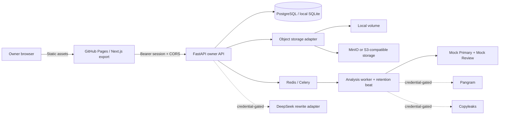

# Paperlight 成熟架构与演进边界

## 当前可运行架构

文稿正文只进入受认证 API。前端静态资源可以公开加载，但浏览器没有后端会话就不能读取、创建或修改文稿。所有分析和补丁绑定不可变版本；用户修改后旧证据立即标记为过期。

## 核心领域规则

- 文稿：800–5,000 个英文单词，稳定段落 ID，默认七天到期。
- 检测：双 Provider 结果、版本号、概率区间、句子范围和明确免责声明；Mock 永远显示演示身份。
- 改写：模型只返回结构化补丁，不直接覆盖正文；数字、比例、引文、引用标记、URL、缩写和专有项受保护。
- 版本：手工保存、补丁接受和恢复都创建新版本，不覆盖历史。
- 文件：DOCX 经过文件名、MIME、ZIP、展开体积、条目、宏、路径和外部关系检查。
- 删除：文档树、任务和对象前缀同步清除；排队任务发现记录已删除时自动退出。
- 日志：不记录论文全文、完整改写稿、Bearer Token 或 Provider Key。

## 当前产品边界

1. **不能宣称与 Turnitin 同等。** Turnitin 的商业语料库和内部判定方法不可复刻。当前 Mock 仅用于交互测试；未来真实结果仍只能被描述为概率估计。
2. **AI 检测不能证明作者身份。** 人类文本会被误报，混合写作和编辑会改变分布。界面必须保留不确定区间、Provider 版本和免责声明。
3. **查重能力尚不等于商业查重。** 当前实现的是文内重复句检查和引用结构自检，不含期刊、作业库或互联网全文相似度数据库。
4. **“降 AI 率”存在学术诚信风险。** 产品按写作质量、可解释补丁和作者确认定位；不提供绕过检测保证，不自动生成来源或事实。
5. **真实 Provider 合同仍需确认。** 模型 ID、响应结构、费率、超时、数据保留和地域条款必须在获得 Key 后用供应商当前文档校验。
6. **GitHub Pages 的 CSP 有静态托管限制。** Next.js 静态引导需要内联脚本；公开版若风险提高，应迁移到可注入 nonce 的反向代理托管。

## 从单人版到公开版

| 阶段 | 必须增加 | 放行条件 |
|---|---|---|
| 单人 Mock | 当前 owner-only、TOTP、Mock 标识、七天删除 | 本地与生产 E2E 通过 |
| 私测真实 Provider | 真实适配器契约测试、零保留/DPA、成本上限、基准集 | 分组误报和校准指标达标 |
| 小规模学生试点 | 多租户身份、行级权限、共享限流、队列隔离、备份恢复、投诉与删除工单 | 安全评审、隐私政策和学校规则评审 |
| 公开发布 | 注册、支付、退款、风控、审计后台、备案/合规、生成内容标识 | 法务、渗透测试、灾备演练和容量测试 |

## 后续优先级

1. 用独立英文课程论文数据集完成检测基准和概率校准。
2. 取得 Provider 凭据后冻结真实契约样例，增加超时、限流、漂移和无效响应测试。
3. 引入 Alembic 数据库迁移、集中式限流和可观测性，但继续禁止正文进入日志。
4. 为公开版实现多租户行级授权、队列配额、对象存储加密和区域化部署。
5. 若要提供商业查重，采购合法语料授权或接入合规供应商，不以网络搜索结果冒充查重数据库。
